<div align="center">

# 👋 Hey there, I'm Abdul Ahad! 


</div>

## 🚀 About Me

<div align="center">
  
> **🌟 Crafting Digital Experiences | Turning Ideas into Reality 🌟**

</div>

<table align="center">
<tr>
<td width="50%">

I'm a passionate **Full-Stack Developer** who loves building scalable web applications and cutting-edge e-commerce solutions. With a keen eye for detail and a drive for perfection, I transform complex problems into elegant, user-friendly solutions.

- 🔭 Currently working on **full-stack e-commerce platforms & APIs**
- 🌱 Learning **advanced React patterns, microservices & cloud architecture**
- 👯 Looking to collaborate on **open-source full-stack projects**
- 💬 Ask me about **React, TypeScript, Node.js, WordPress, Shopify**
- ⚡ Fun fact: **I can debug both frontend and backend simultaneously! 😄**

</td>
<td width="50%" align="center">


</td>
</tr>
</table>


## 🛠️ Tech Arsenal

<div align="center">

### 🎨 Frontend Mastery
<p>
  
</p>

### ⚙️ Backend Power
<p>
  
</p>

### 🛍️ E-commerce Excellence
<p>
  
  
  
</p>

### 🔧 Development Tools
<p>
  
</p>

</div>

<div align="center">
  
### 🏆 **Professional Expertise Levels**

```mermaid
graph LR
    A[🎨 Frontend] --> B[Expert ⭐⭐⭐⭐⭐]
    C[⚙️ Backend] --> D[Expert ⭐⭐⭐⭐⭐]
    E[🛍️ E-commerce] --> F[Expert ⭐⭐⭐⭐⭐]
    G[☁️ DevOps] --> H[Advanced ⭐⭐⭐⭐]
    I[📱 Mobile] --> J[Intermediate ⭐⭐⭐]
```



</div>


# Enhanced GitHub README Sections

## 📊 GitHub Analytics

<div align="center">


### 🔥 **Performance Dashboard**

<table>
<tr>
<td align="center" width="50%">

**📈 GitHub Statistics**
<br/>
<picture>
  <source media="(prefers-color-scheme: dark)" srcset="https://github-readme-stats-sigma-five.vercel.app/api?username=abdulahad-2&show_icons=true&theme=radical&hide_border=true&count_private=true&include_all_commits=true&card_width=400">
  
</picture>

</td>
<td align="center" width="50%">

**💻 Language Distribution**
<br/>
<picture>
  <source media="(prefers-color-scheme: dark)" srcset="https://github-readme-stats-sigma-five.vercel.app/api/top-langs/?username=abdulahad-2&layout=compact&theme=radical&hide_border=true&langs_count=8&card_width=400">
  
</picture>

</td>
</tr>
</table>

<br/>

### 🔥 **Streak & Activity**

<picture>
  <source media="(prefers-color-scheme: dark)" srcset="https://github-readme-streak-stats.herokuapp.com/?user=abdulahad-2&theme=radical&hide_border=true&stroke=00D9FF&ring=00D9FF&fire=FF6B35&currStreakLabel=00D9FF">
  
</picture>

<br/><br/>

### 📊 **Contribution Graph**

<picture>
  <source media="(prefers-color-scheme: dark)" srcset="https://github-readme-activity-graph.vercel.app/graph?username=abdulahad-2&theme=react-dark&hide_border=true&area=true&color=00D9FF&point=FF6B35&line=00D9FF">
  
</picture>

<br/>

### 🏆 **Achievement Showcase**


<table>
<tr>
<td width="25%">

</td>
<td width="25%">

</td>
<td width="25%">

</td>
<td width="25%">

</td>
</tr>
</table>

</div>


## 🎯 What I Bring to the Table

<div align="center">


</div>

<table align="center">
<tr>
<td align="center" width="33%">

<div style="border: 2px solid #00D9FF; border-radius: 15px; padding: 20px; background: linear-gradient(135deg, #667eea 0%, #764ba2 100%);">

### 🛒 **E-commerce Wizard**


```javascript
const ecommerce = {
  platforms: ['WordPress', 'Shopify', 'WooCommerce'],
  integrations: ['PayPal', 'Stripe', 'Square'],
  features: [
    'Payment Gateways 💳',
    'Inventory Management 📦',
    'SEO Optimization 🔍',
    'Mobile Optimization 📱'
  ],
  speciality: 'Converting visitors to customers',
  conversionRate: '30%+ improvement',
  satisfaction: '⭐⭐⭐⭐⭐'
}
```


</div>

</td>
<td align="center" width="33%">

<div style="border: 2px solid #FF6B35; border-radius: 15px; padding: 20px; background: linear-gradient(135deg, #f093fb 0%, #f5576c 100%);">

### 🎨 **Frontend Artisan**


```javascript
const frontend = {
  frameworks: ['React ⚛️', 'Next.js 🚀', 'TypeScript 📘'],
  styling: ['Tailwind 🎨', 'CSS3 ✨', 'SASS 💎'],
  tools: ['Figma 🎯', 'Adobe XD 🖌️'],
  focus: [
    'Pixel-perfect design 🎯',
    'Responsive layouts 📱',
    'Performance optimization ⚡',
    'Accessibility standards ♿'
  ],
  lighthouse: '95+ scores',
  motto: 'Beauty meets functionality'
}
```


</div>

</td>
<td align="center" width="33%">

<div style="border: 2px solid #4CAF50; border-radius: 15px; padding: 20px; background: linear-gradient(135deg, #a8edea 0%, #fed6e3 100%);">

### ⚡ **Backend Architect**


```javascript
const backend = {
  runtime: ['Node.js 🟢', 'Express ⚡', 'PHP 🐘'],
  databases: ['MongoDB 🍃', 'MySQL 🐬', 'PostgreSQL 🐘'],
  cloud: ['AWS ☁️', 'Vercel 🚀', 'Firebase 🔥'],
  architecture: [
    'RESTful APIs 🔗',
    'GraphQL 📊',
    'Microservices 🧩',
    'Database optimization 🗄️'
  ],
  security: 'Top priority',
  uptime: '99.9%+'
}
```


</div>

</td>
</tr>
</table>

<div align="center">

### 🎯 **Professional Impact Metrics**

<table>
<tr>
<td align="center">

</td>
<td align="center">

</td>
<td align="center">

</td>
<td align="center">

</td>
</tr>
</table>

</div>


## 🌟 Featured GitHub Projects

<div align="center">


</div>

<table>
<tr>
<td width="50%" align="center">

### 🎥 **Sage Video Downloader**

<a href="https://github.com/abdulahad-2/Sage-video-downloader">
  
</a>

<div>


</div>

**🌟 Key Features:**
- Multi-platform video downloading
- High-quality format support
- Batch processing capabilities
- User-friendly interface

</td>
<td width="50%" align="center">

### 🤖 **AI Resume Analyzer**

<a href="https://github.com/abdulahad-2/AI-resume-analyzer-generator">
  
</a>

<div>


</div>

**🌟 Key Features:**
- AI-powered resume analysis
- Skill gap identification
- ATS compatibility check
- Resume generation tools

</td>
</tr>
<tr>
<td width="50%" align="center">

### 💼 **Portfolio Website V2**

<a href="https://github.com/abdulahad-2/portfolio2">
  
</a>

<div>


</div>

**🌟 Key Features:**
- Modern responsive design
- Dark/Light mode toggle
- Smooth animations
- SEO optimized

</td>
<td width="50%" align="center">

### 🎨 **Portfolio Website V1**

<a href="https://github.com/abdulahad-2/portfolio">
  
</a>

<div>


</div>

**🌟 Key Features:**
- Interactive animations
- Project showcases
- Contact integration
- Mobile-first design

</td>
</tr>
</table>

<div align="center">

### 🎯 **Repository Stats Overview**


<br/>

**📊 Quick Repository Facts**


</div>


## 🚀 Live Production Projects

<div align="center">


</div>

### 🛒 **E-commerce & Marketplace Excellence**

<table>
<tr>
<td align="center" width="50%">

<div style="position: relative; overflow: hidden; border-radius: 20px; box-shadow: 0 10px 30px rgba(0,217,255,0.3); background: linear-gradient(135deg, #667eea 0%, #764ba2 100%); padding: 25px; margin: 10px;">


[](https://themehfil.ca/)

**Tech Stack:**
<div>


</div>

**🎯 Project Highlights:**
- 🔥 **50,000+** monthly visitors
- 💰 **$100K+** in sales generated
- ⚡ **2.3s** average load time
- 📱 **98%** mobile optimization score

**Features Delivered:**
```yaml
✅ Advanced Product Filtering
✅ Multi-Vendor Support
✅ Payment Gateway Integration
✅ Real-time Inventory Management
✅ SEO-Optimized Architecture
✅ Custom Admin Dashboard
```

</div>

</td>
<td align="center" width="50%">

<div style="position: relative; overflow: hidden; border-radius: 20px; box-shadow: 0 10px 30px rgba(255,107,53,0.3); background: linear-gradient(135deg, #f093fb 0%, #f5576c 100%); padding: 25px; margin: 10px;">


[](https://khanjeecanada.com/)

**Tech Stack:**
<div>


</div>

**🎯 Project Highlights:**
- 🍴 **15+** locations managed
- 📱 **25%** increase in online orders
- ⭐ **4.8/5** customer satisfaction
- 🚀 **95+** Lighthouse performance

**Features Delivered:**
```yaml
✅ Online Ordering System
✅ Multi-Location Management
✅ Interactive Menu Display
✅ Table Reservation System
✅ Customer Reviews Integration
✅ Social Media Integration
```

</div>

</td>
</tr>
</table>

### 🛍️ **Advanced E-commerce Solutions**

<table>
<tr>
<td align="center" width="50%">

<div style="position: relative; overflow: hidden; border-radius: 20px; box-shadow: 0 10px 30px rgba(122,181,92,0.3); background: linear-gradient(135deg, #a8edea 0%, #fed6e3 100%); padding: 25px; margin: 10px;">


[](https://by39tk-uv.myshopify.com/)

**Tech Stack:**
<div>


</div>

**🎯 Performance Metrics:**
- 💰 **40%** conversion rate increase
- ⚡ **1.8s** page load time
- 📱 **100%** mobile responsive
- 🔐 **PCI DSS** compliant

**Advanced Features:**
```yaml
✅ Custom Checkout Flow
✅ Inventory Synchronization
✅ Multi-Payment Gateway
✅ Advanced Analytics
✅ Email Marketing Integration
✅ Social Media Shopping
```

</div>

</td>
<td align="center" width="50%">

<div style="position: relative; overflow: hidden; border-radius: 20px; box-shadow: 0 10px 30px rgba(97,218,251,0.3); background: linear-gradient(135deg, #667eea 0%, #764ba2 100%); padding: 25px; margin: 10px;">


[](https://abdulahad-2.github.io/admin-dashboard/#/dashboard)

**Tech Stack:**
<div>


</div>

**🎯 Dashboard Features:**
- 📊 **Real-time** data visualization
- 👥 **Multi-role** user management
- 📱 **Responsive** design system
- 🔔 **Push** notifications

**Core Modules:**
```yaml
✅ Analytics & Reporting
✅ User Management System
✅ Real-time Notifications
✅ Data Export/Import
✅ Role-Based Access Control
✅ Dark/Light Theme Toggle
```

</div>

</td>
</tr>
</table>

### 🏢 **Professional Business Websites**

<table>
<tr>
<td align="center" width="33%">

<div style="border-radius: 15px; box-shadow: 0 8px 25px rgba(74,144,226,0.3); background: linear-gradient(135deg, #667eea 0%, #764ba2 100%); padding: 20px; margin: 10px;">


[](https://igorvainshtein.com/)

**Professional Portfolio**
- ⚡ Modern design
- 📱 Mobile-first
- 🔍 SEO optimized
- 📈 Analytics integrated

</div>

</td>
<td align="center" width="33%">

<div style="border-radius: 15px; box-shadow: 0 8px 25px rgba(46,139,87,0.3); background: linear-gradient(135deg, #a8edea 0%, #fed6e3 100%); padding: 20px; margin: 10px;">


[](https://priorityib.com.au/)

**Investment Platform**
- 💰 Financial services
- 🔐 Security focused
- 📊 Data visualization
- 🌐 Global reach

</div>

</td>
<td align="center" width="33%">

<div style="border-radius: 15px; box-shadow: 0 8px 25px rgba(255,140,0,0.3); background: linear-gradient(135deg, #f093fb 0%, #f5576c 100%); padding: 20px; margin: 10px;">


[](https://aidn.org.au/)

**Association Website**
- 🏛️ Non-profit org
- 🌏 Community focused
- 📅 Event management
- 👥 Member portal

</div>

</td>
</tr>
</table>

<div align="center">

### 🎯 **Project Portfolio Summary**

<table style="border-collapse: collapse; margin: 20px auto;">
<tr>
<td align="center" style="padding: 15px; background: linear-gradient(135deg, #667eea 0%, #764ba2 100%); border-radius: 10px; margin: 5px;">

<br/><strong>Reliability</strong>
</td>
</tr>
</table>

---

**🎨 WordPress Development • 🛍️ Shopify Solutions • ⚡ React Applications • 🏢 Business Websites**

*Delivering production-ready solutions that scale globally and drive real business results*

---

</div>


## 🚀 Current Mission

<div align="center">


</div>

<table>
<tr>
<td width="50%">

<div style="border-radius: 20px; background: linear-gradient(135deg, #667eea 0%, #764ba2 100%); padding: 25px; box-shadow: 0 15px 35px rgba(102, 126, 234, 0.3);">

### 🎯 **Current Focus Areas**

```typescript
const currentMission = {
  🎓 learning: [
    "🔥 Advanced TypeScript patterns",
    "⚡ Next.js 14 App Router",
    "📊 GraphQL & Apollo Client",
    "🏗️ Microservices Architecture",
    "🤖 AI/ML Integration",
    "☁️ AWS Cloud Architecture"
  ],
  
  🚀 building: [
    "🛒 Full-Stack E-commerce SaaS",
    "📚 React Component Library",
    "🔗 GraphQL & REST APIs",
    "☁️ Serverless Applications",
    "📱 Progressive Web Apps",
    "🧠 AI-Powered Tools"
  ],
  
  🔬 exploring: [
    "🏗️ Serverless architecture",
    "🤖 OpenAI API integration",
    "🐳 Docker & Kubernetes",
    "🔗 Web3 & Blockchain",
    "⚡ Edge Computing",
    "🎨 3D Web Experiences"
  ],
  
  🎯 goals: {
    shortTerm: "Launch SaaS platform Q2 2024",
    longTerm: "Build tech startup ecosystem",
    impact: "Democratize web development",
    motto: "Code that changes lives 🌟"
  }
};

console.log("Building the future, one line at a time! 🚀");
```

### 📈 **2024 Development Roadmap**

<div style="background: rgba(255,255,255,0.1); border-radius: 10px; padding: 15px; margin: 10px 0;">

**Q1 2024** 🌱
- ✅ Master TypeScript advanced patterns
- ✅ Build 3 production-ready apps
- 🔄 Launch personal tech blog

**Q2 2024** 🚀
- 🔄 SaaS platform MVP launch
- 📊 Reach 100K+ monthly users
- 💰 Generate first $10K MRR

**Q3 2024** 📈
- 🎯 Scale to 6-figure revenue
- 👥 Build developer community
- 🌍 Expand globally

**Q4 2024** 🏆
- 🚀 Launch second product
- 📚 Publish tech course
- 🎪 Speak at conferences

</div>

</div>

</td>
<td width="50%" align="center">

<div style="border-radius: 20px; background: linear-gradient(135deg, #f093fb 0%, #f5576c 100%); padding: 25px; box-shadow: 0 15px 35px rgba(240, 147, 251, 0.3);">

### 🎬 **Development in Action**

<div style="position: relative; width: 100%; height: 300px; border-radius: 15px; overflow: hidden; box-shadow: 0 10px 30px rgba(0,0,0,0.3);">

<!-- Autoplay coding video/gif -->


<div style="position: absolute; bottom: 10px; left: 10px; right: 10px; background: rgba(0,0,0,0.7); border-radius: 10px; padding: 10px; color: white;">
<strong>🔥 Live Coding Session</strong><br/>
<small>Building scalable applications with modern tech stack</small>
</div>

</div>

### 🎪 **Development Stats Dashboard**

<div style="display: grid; grid-template-columns: 1fr 1fr; gap: 15px; margin: 20px 0;">

<div style="background: rgba(255,255,255,0.1); border-radius: 10px; padding: 15px; text-align: center;">
<strong style="color: #00D9FF;">⏰ Code Time</strong><br/>
<span style="font-size: 24px; color: #FFD700;">8-12 hrs/day</span>
</div>

<div style="background: rgba(255,255,255,0.1); border-radius: 10px; padding: 15px; text-align: center;">
<strong style="color: #4CAF50;">🔥 Streak</strong><br/>
<span style="font-size: 24px; color: #FFD700;">365+ days</span>
</div>

<div style="background: rgba(255,255,255,0.1); border-radius: 10px; padding: 15px; text-align: center;">
<strong style="color: #FF6B35;">☕ Coffee</strong><br/>
<span style="font-size: 24px; color: #FFD700;">∞ cups</span>
</div>

<div style="background: rgba(255,255,255,0.1); border-radius: 10px; padding: 15px; text-align: center;">
<strong style="color: #9C27B0;">🧠 Learning</strong><br/>
<span style="font-size: 24px; color: #FFD700;">24/7 mode</span>
</div>

</div>

### 📊 **Weekly Activity Heatmap**


### 🎵 **Coding Playlist**

<div style="background: rgba(255,255,255,0.1); border-radius: 10px; padding: 15px; margin: 15px 0;">
<strong>🎧 Currently Vibing To:</strong><br/>
🎵 Lo-fi Hip Hop for Coding<br/>
🎵 Synthwave & Retrowave<br/>
🎵 Ambient Electronic<br/>
🎵 Epic Orchestral Music
</div>

</div>

</td>
</tr>
</table>

<div align="center">

### 🎯 **Skills Evolution Timeline**

<table style="width: 100%; margin: 20px 0;">
<tr>
<td align="center" style="width: 20%; padding: 10px;">
<div style="background: linear-gradient(135deg, #667eea 0%, #764ba2 100%); border-radius: 15px; padding: 20px;">
<strong>2021</strong><br/>
🌱 Started Journey<br/>
HTML, CSS, JavaScript
</div>
</td>
<td align="center" style="width: 20%; padding: 10px;">
<div style="background: linear-gradient(135deg, #f093fb 0%, #f5576c 100%); border-radius: 15px; padding: 20px;">
<strong>2022</strong><br/>
⚛️ React Mastery<br/>
Node.js, Express
</div>
</td>
<td align="center" style="width: 20%; padding: 10px;">
<div style="background: linear-gradient(135deg, #a8edea 0%, #fed6e3 100%); border-radius: 15px; padding: 20px;">
<strong>2023</strong><br/>
🛍️ E-commerce Expert<br/>
WordPress, Shopify
</div>
</td>
<td align="center" style="width: 20%; padding: 10px;">
<div style="background: linear-gradient(135deg, #667eea 0%, #764ba2 100%); border-radius: 15px; padding: 20px;">
<strong>2024</strong><br/>
🚀 Full-Stack Pro<br/>
TypeScript, Cloud
</div>
</td>
<td align="center" style="width: 20%; padding: 10px;">
<div style="background: linear-gradient(135deg, #f093fb 0%, #f5576c 100%); border-radius: 15px; padding: 20px;">
<strong>2025</strong><br/>
🤖 AI Integration<br/>
Tech Entrepreneur
</div>
</td>
</tr>
</table>

</div>


## 🤝 Let's Connect & Build Something Amazing!

<div align="center">


</div>

<table style="width: 100%; border-collapse: collapse;">
<tr>
<td align="center" width="25%" style="padding: 20px;">

<div style="background: linear-gradient(135deg, #667eea 0%, #764ba2 100%); border-radius: 20px; padding: 25px; box-shadow: 0 10px 30px rgba(102, 126, 234, 0.3); transition: transform 0.3s ease;">

### 📧 **Email Me**


<a href="mailto:abdul.ahadt732@gmail.com">
  
</a>

**💌 Let's Discuss Your Project**

<div style="background: rgba(255,255,255,0.1); border-radius: 10px; padding: 10px; margin: 10px 0; font-size: 12px;">
📋 Project Planning<br/>
💰 Budget Discussion<br/>
⏰ Timeline Planning<br/>
🎯 Goal Setting
</div>


</div>

</td>
<td align="center" width="25%" style="padding: 20px;">

<div style="background: linear-gradient(135deg, #f093fb 0%, #f5576c 100%); border-radius: 20px; padding: 25px; box-shadow: 0 10px 30px rgba(240, 147, 251, 0.3);">

### 🌐 **My Portfolio**


<a href="https://ahad-dev.vercel.app/" target="_blank">
  
</a>

**🎨 Explore My Work**

<div style="background: rgba(255,255,255,0.1); border-radius: 10px; padding: 10px; margin: 10px 0; font-size: 12px;">
🚀 Live Projects<br/>
💼 Case Studies<br/>
🎯 Process Insights<br/>
📊 Results & Metrics
</div>


</div>

</td>
<td align="center" width="25%" style="padding: 20px;">

<div style="background: linear-gradient(135deg, #a8edea 0%, #fed6e3 100%); border-radius: 20px; padding: 25px; box-shadow: 0 10px 30px rgba(168, 237, 234, 0.3);">

### 💼 **LinkedIn**


<a href="https://www.linkedin.com/in/abdul-ahad-7908a82b4" target="_blank">
  
</a>

**🤝 Professional Networking**

<div style="background: rgba(255,255,255,0.1); border-radius: 10px; padding: 10px; margin: 10px 0; font-size: 12px;">
👥 Network Expansion<br/>
💼 Business Opportunities<br/>
📚 Industry Insights<br/>
🎯 Collaboration
</div>


</div>

</td>
<td align="center" width="25%" style="padding: 20px;">

<div style="background: linear-gradient(135deg, #667eea 0%, #764ba2 100%); border-radius: 20px; padding: 25px; box-shadow: 0 10px 30px rgba(102, 126, 234, 0.3);">

### 📞 **WhatsApp**


<a href="https://wa.me/923259684493" target="_blank">
  
</a>  

**💬 Instant Communication**

<div style="background: rgba(255,255,255,0.1); border-radius: 10px; padding: 10px; margin: 10px 0; font-size: 12px;">
⚡ Quick Responses<br/>
🎥 Video Calls<br/>
📱 Mobile Friendly<br/>
🌍 Global Reach
</div>


</div>

</td>
</tr>
</table>

<div align="center" style="margin: 30px 0;">

### 🎯 **Why Choose Me?**

<table style="margin: 20px auto;">
<tr>
<td align="center" style="padding: 15px; background: linear-gradient(135deg, #667eea 0%, #764ba2 100%); border-radius: 15px; margin: 10px;">

<br/><strong>Lightning Fast</strong><br/>
<small>Quick turnaround without compromising quality</small>
</td>
<td align="center" style="padding: 15px; background: linear-gradient(135deg, #f093fb 0%, #f5576c 100%); border-radius: 15px; margin: 10px;">

<br/><strong>Premium Quality</strong><br/>
<small>Clean, scalable, and maintainable code</small>
</td>
<td align="center" style="padding: 15px; background: linear-gradient(135deg, #a8edea 0%, #fed6e3 100%); border-radius: 15px; margin: 10px;">

<br/><strong>Always Available</strong><br/>
<small>Continuous support and maintenance</small>
</td>
<td align="center" style="padding: 15px; background: linear-gradient(135deg, #667eea 0%, #764ba2 100%); border-radius: 15px; margin: 10px;">

<br/><strong>Perfect Results</strong><br/>
<small>Until you're completely satisfied</small>
</td>
</tr>
</table>

### 🚀 **Ready to Start Your Project?**

<div style="background: linear-gradient(135deg, #667eea 0%, #764ba2 100%); border-radius: 20px; padding: 25px; margin: 20px auto; max-width: 600px; box-shadow: 0 15px 35px rgba(102, 126, 234, 0.4);">

<strong style="font-size: 20px;">🎯 Let's Transform Your Ideas Into Reality!</strong>

<div style="margin: 15px 0; display: flex; justify-content: space-around; flex-wrap: wrap;">

<a href="mailto:abdul.ahadt732@gmail.com?subject=Project Inquiry&body=Hi Abdul! I'd like to discuss a project...">

</a>

<a href="https://wa.me/923259684493?text=Hi Abdul! I have a project idea...">

</a>

</div>

<div style="font-size: 14px; color: rgba(255,255,255,0.8); margin-top: 15px;">
✨ <strong>Free consultation</strong> • 📊 <strong>Project planning</strong> • 💰 <strong>Transparent pricing</strong> • 🎯 <strong>Results guaranteed</strong>
</div>

</div>

</div>="padding: 15px; background: linear-gradient(135deg, #667eea 0%, #764ba2 100%); border-radius: 10px; margin: 5px;">

<br/><strong>Live Projects</strong>
</td>
<td align="center" style="padding: 15px; background: linear-gradient(135deg, #f093fb 0%, #f5576c 100%); border-radius: 10px; margin: 5px;">

<br/><strong>Client Success</strong>
</td>
<td align="center" style="padding: 15px; background: linear-gradient(135deg, #a8edea 0%, #fed6e3 100%); border-radius: 10px; margin: 5px;">

<br/><strong>Global Impact</strong>
</td>
<td align="center" style
  
### 💭 **Developer Wisdom**

> *"Code is like humor. When you have to explain it, it's bad."* – **Cory House**
> 
> *"First, solve the problem. Then, write the code."* – **John Johnson**
>
> *"The best error message is the one that never shows up."* – **Thomas Fuchs**

</div>

## 🎨 Fun Zone

<div align="center">

```ascii
     ╭─────────────────────────────────────────────────────────────╮
     │  ████████╗██╗  ██╗ █████╗ ███╗   ██╗██╗  ██╗███████╗       │
     │  ╚══██╔══╝██║  ██║██╔══██╗████╗  ██║██║ ██╔╝██╔════╝       │
     │     ██║   ███████║███████║██╔██╗ ██║█████╔╝ ███████╗       │
     │     ██║   ██╔══██║██╔══██║██║╚██╗██║██╔═██╗ ╚════██║       │
     │     ██║   ██║  ██║██║  ██║██║ ╚████║██║  ██╗███████║       │
     │     ╚═╝   ╚═╝  ╚═╝╚═╝  ╚═╝╚═╝  ╚═══╝╚═╝  ╚═╝╚══════╝       │
     │                                                             │
     │       🌟 Thanks for visiting my profile! 🌟                 │
     │         Star ⭐ my repos if you like them!                  │
     │              Let's build something amazing! 🚀             │
     ╰─────────────────────────────────────────────────────────────╯
```


---

<div align="center">
  
**💻 Let's code the future together! 🚀**


</div>
