<div align="center">

# 👋 Hey there, I'm Abdul Ahad! 


</div>

## 🚀 About Me

<div align="center">
  
> **🌟 Crafting Digital Experiences | Turning Ideas into Reality 🌟**

</div>

<table align="center">
<tr>
<td width="50%">

I'm a passionate **Full-Stack Developer** who loves building scalable web applications and cutting-edge e-commerce solutions. With a keen eye for detail and a drive for perfection, I transform complex problems into elegant, user-friendly solutions.

- 🔭 Currently working on **full-stack e-commerce platforms & APIs**
- 🌱 Learning **advanced React patterns, microservices & cloud architecture**
- 👯 Looking to collaborate on **open-source full-stack projects**
- 💬 Ask me about **React, TypeScript, Node.js, WordPress, Shopify**
- ⚡ Fun fact: **I can debug both frontend and backend simultaneously! 😄**

</td>
<td width="50%" align="center">


</td>
</tr>
</table>


## 🛠️ Tech Arsenal

<div align="center">

### 🎨 Frontend Mastery
<p>
  
</p>

### ⚙️ Backend Power
<p>
  
</p>

### 🛍️ E-commerce Excellence
<p>
  
  
  
</p>

### 🔧 Development Tools
<p>
  
</p>

</div>

<div align="center">
  
### 🏆 **Professional Expertise Levels**

```mermaid
graph LR
    A[🎨 Frontend] --> B[Expert ⭐⭐⭐⭐⭐]
    C[⚙️ Backend] --> D[Expert ⭐⭐⭐⭐⭐]
    E[🛍️ E-commerce] --> F[Expert ⭐⭐⭐⭐⭐]
    G[☁️ DevOps] --> H[Advanced ⭐⭐⭐⭐]
    I[📱 Mobile] --> J[Intermediate ⭐⭐⭐]
```



</div>


## 📊 GitHub Analytics

<div align="center">
  
<picture>
  <source media="(prefers-color-scheme: dark)" srcset="https://github-readme-stats-sigma-five.vercel.app/api?username=abdulahad-2&show_icons=true&theme=radical&hide_border=true&count_private=true&include_all_commits=true">
  
</picture>

<picture>
  <source media="(prefers-color-scheme: dark)" srcset="https://github-readme-stats-sigma-five.vercel.app/api/top-langs/?username=abdulahad-2&layout=compact&theme=radical&hide_border=true&langs_count=8">
  
</picture>

</div>

<div align="center">
  
<picture>
  <source media="(prefers-color-scheme: dark)" srcset="https://github-readme-streak-stats.herokuapp.com/?user=abdulahad-2&theme=radical&hide_border=true">
  
</picture>

</div>

<div align="center">
  
<picture>
  <source media="(prefers-color-scheme: dark)" srcset="https://github-readme-activity-graph.vercel.app/graph?username=abdulahad-2&theme=react-dark&hide_border=true&area=true">
  
</picture>

</div>

## 🎯 What I Bring to the Table

<div align="center">

<table>
<tr>
<td align="center" width="33%">

### 🛒 **E-commerce Magic**
```javascript
const ecommerce = {
  platforms: ['WordPress', 'Shopify', 'WooCommerce'],
  features: ['Payment Gateways', 'Inventory Management', 'SEO Optimization'],
  expertise: 'Converting visitors to customers 💰'
}
```

</td>
<td align="center" width="33%">

### 🎨 **Frontend Artistry**
```javascript
const frontend = {
  frameworks: ['React', 'Next.js', 'TypeScript'],
  styling: ['Tailwind', 'CSS3', 'SASS'],
  focus: 'Pixel-perfect responsive design ✨'
}
```

</td>
<td align="center" width="33%">

### ⚡ **Backend Excellence**
```javascript
const backend = {
  runtime: ['Node.js', 'Express', 'PHP'],
  databases: ['MongoDB', 'MySQL', 'PostgreSQL'],
  architecture: 'Scalable & secure APIs 🔐'
}
```

</td>
</tr>
</table>

</div>


## 🌟 Featured GitHub Projects

<div align="center">

<a href="https://github.com/abdulahad-2/Sage-video-downloader">
  
</a>

<a href="https://github.com/abdulahad-2/AI-resume-analyzer-generator">
  
</a>

<a href="https://github.com/abdulahad-2/portfolio2">
  
</a>

<a href="https://github.com/abdulahad-2/portfolio">
  
</a>

</div>


## 🚀 Live Production Projects

<div align="center">

### 🎨 **WordPress & E-commerce Mastery**

<table>
<tr>
<td align="center" width="50%">


[](https://themehfil.ca/)

`WordPress` • `WooCommerce` • `Custom Theme`

*Digital marketplace with advanced e-commerce functionality*

**Features:** Payment Integration, User Dashboard, Product Management

</td>
<td align="center" width="50%">


[](https://khanjeecanada.com/)

`WordPress` • `Custom Design` • `Restaurant`

*Professional restaurant website with online ordering*

**Features:** Menu Management, Online Ordering, Location Maps

</td>
</tr>
</table>

### 🛍️ **Shopify & Modern Web Solutions**

<table>
<tr>
<td align="center" width="50%">


[](https://by39tk-uv.myshopify.com/)

`Shopify` • `Liquid` • `Custom Theme`

*Feature-rich e-commerce store with custom functionality*

**Features:** Custom Checkout, Inventory Sync, Payment Gateway

</td>
<td align="center" width="50%">


[](https://abdulahad-2.github.io/admin-dashboard/#/dashboard)

`React` • `Dashboard` • `Charts.js`

*Modern admin panel with analytics & management tools*

**Features:** Data Visualization, User Management, Real-time Updates

</td>
</tr>
</table>

### 🏢 **Professional Business Websites**

<table>
<tr>
<td align="center" width="33%">


[](https://igorvainshtein.com/)

`WordPress` • `Professional`

*Executive portfolio*

</td>
<td align="center" width="33%">


[](https://priorityib.com.au/)

`WordPress` • `Finance`

*Investment platform*

</td>
<td align="center" width="33%">


[](https://aidn.org.au/)

`WordPress` • `Non-profit`

*Association website*

</td>
</tr>
</table>

</div>

<div align="center">

---

**🎨 WordPress Development • 🛍️ Shopify Solutions • ⚡ React Applications • 🏢 Business Websites**

*Delivering production-ready solutions across multiple platforms and industries*

---

</div>

## 🚀 Current Mission

<table>
<tr>
<td width="50%">

### 🎯 **Current Focus**

```typescript
const currentMission = {
  learning: [
    "Advanced TypeScript patterns",
    "Next.js 14 App Router",
    "GraphQL & Apollo",
    "Microservices Architecture"
  ],
  building: [
    "🛒 E-commerce SaaS platform",
    "📚 React component library",
    "🔗 REST & GraphQL APIs",
    "☁️ Cloud-native applications"
  ],
  exploring: [
    "Serverless architecture",
    "AI/ML integration",
    "Docker & Kubernetes",
    "Web3 technologies"
  ],
  goal: "Building full-stack solutions that scale! 🚀"
};
```

</td>
<td width="50%" align="center">


### 🎪 **Fun Development Stats**


</td>
</tr>
</table>


## 🤝 Let's Connect & Build Something Amazing!

<div align="center">

<table>
<tr>
<td align="center" width="25%">

### 📧 **Email**
<a href="mailto:abdul.ahadt732@gmail.com">
  
</a>
*Let's discuss your project*

</td>
<td align="center" width="25%">

### 🌐 **Portfolio**
<a href="https://ahad-dev.vercel.app/" target="_blank">
  
</a>
*Check out my work*


</td>
<td align="center" width="25%">

### 💼 **LinkedIn**
<a href="https://www.linkedin.com/in/abdul-ahad-7908a82b4" target="_blank">
  
</a>
*Let's connect professionally*

</td>
<td align="center" width="25%">

### 📞 **WhatsApp**
<a href="https://wa.me/923259684493" target="_blank">
  
</a>  
*Chat with me on WhatsApp*

</td>
</tr>
</table>

</div>

<div align="center">
  
### 💭 **Developer Wisdom**

> *"Code is like humor. When you have to explain it, it's bad."* – **Cory House**
> 
> *"First, solve the problem. Then, write the code."* – **John Johnson**
>
> *"The best error message is the one that never shows up."* – **Thomas Fuchs**

</div>

## 🎨 Fun Zone

<div align="center">

```ascii
     ╭─────────────────────────────────────────────────────────────╮
     │  ████████╗██╗  ██╗ █████╗ ███╗   ██╗██╗  ██╗███████╗       │
     │  ╚══██╔══╝██║  ██║██╔══██╗████╗  ██║██║ ██╔╝██╔════╝       │
     │     ██║   ███████║███████║██╔██╗ ██║█████╔╝ ███████╗       │
     │     ██║   ██╔══██║██╔══██║██║╚██╗██║██╔═██╗ ╚════██║       │
     │     ██║   ██║  ██║██║  ██║██║ ╚████║██║  ██╗███████║       │
     │     ╚═╝   ╚═╝  ╚═╝╚═╝  ╚═╝╚═╝  ╚═══╝╚═╝  ╚═╝╚══════╝       │
     │                                                             │
     │       🌟 Thanks for visiting my profile! 🌟                 │
     │         Star ⭐ my repos if you like them!                  │
     │              Let's build something amazing! 🚀             │
     ╰─────────────────────────────────────────────────────────────╯
```


---

<div align="center">
  
**💻 Let's code the future together! 🚀**


</div>
